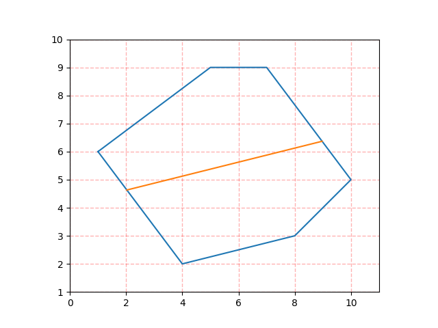
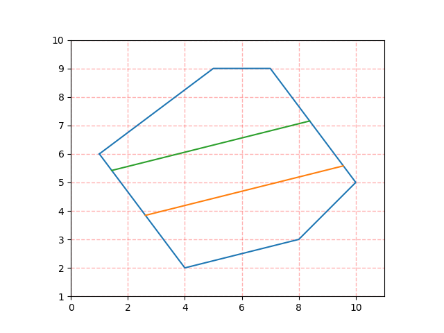

# divide_polygon

A python implement for dividing polygon algorithm.

```py
def divide_polygon(poly: _Polygon, n: int, idx: int, in_place=False) -> List[_Segment]:
    """Divede polygon with lines parallel with its idx-th edge.

    Args:
        poly (_Polygon): counterclockwise polygon with edge p[0]p[-1] on y axis.
        n (int): number of parts to divide polygon into.
        idx (int): index of edge to be paralleled with.
        in_place (bool, optional): whether to operate in place (If true, input data would be changed). Defaults to False.

    Returns:
        List[_Segment]: dividing segments
    """
```

## Effect Picture

divide into 2 parts:



divide into 3 parts:



divide into 4 parts:


divide into 5 parts:


