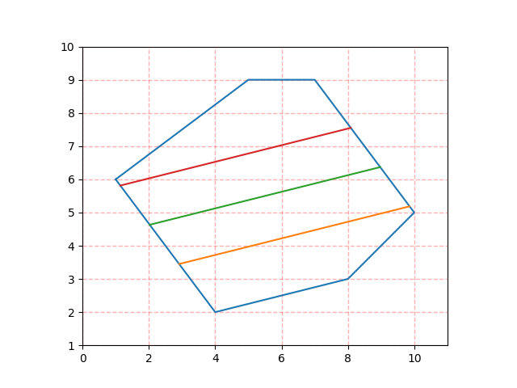
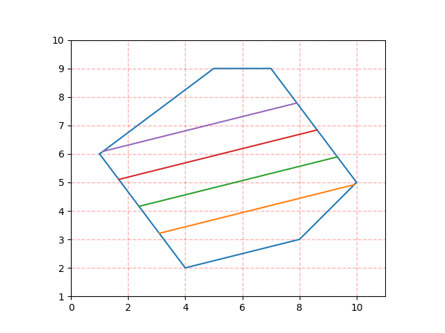

# divide_polygon

A python implement for dividing polygon algorithm.

```py
def divide_polygon(
    poly: List[Point], n: int, idx: int, tolerance=1e-12, in_place=False
):
    """Divede polygon with parallel lines

    Args:
        poly (List[Point]): counterclockwise polygon with edge p[0]p[-1] on y axis.
        n (int): divisor
        idx (int): edge (p[idx-1]p[idx]) sepcified to parallel with.
        tolerance (float, optional): tolerance, expressed as polygon area percentage. Defaults to 1e-12.
        in_place (bool, optional): whether to operate in place.

    Returns:
        [type]: [description]
    """
```

## Effect Picture

divide into 2 parts:

divide into 3 parts:

divide into 4 parts:

divide into 5 parts:

